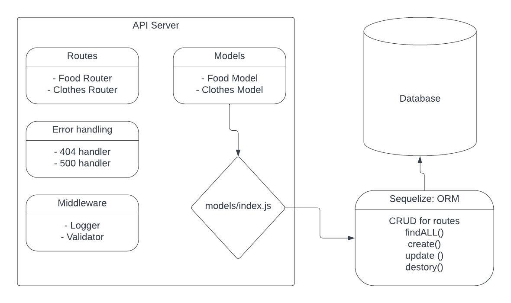
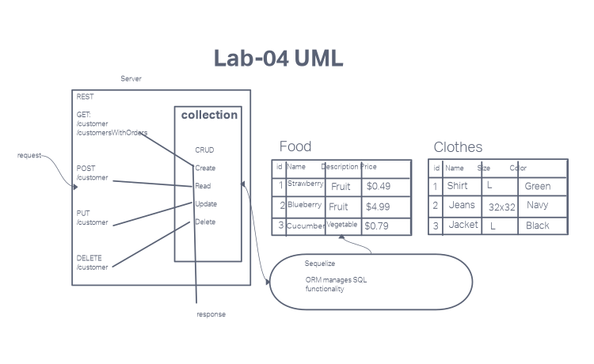

# LAB - 03

## Project: Api-Server

### Author: Kao Saelor

### Problem Domain

This is a basic Express server including use of SQL data models using best practices, including server modularization, use of middleware, and tests.

### Links and Resources

- [GitHub Actions ci/cd](https://github.com/CodingKao/api-server/pulls?q=is%3Apr+is%3Aclosed)

- [back-end prod server url](https://api-server-u31c.onrender.com/)

### Collaborators

- Kenya Womack
- Hayden Cooper
- Coriana Williams

### Setup

#### `.env` requirements (where applicable)

Using only PORT which can be found on `.env.sample`

#### How to initialize/run your application (where applicable)

Clone repo, `npm i`, then run `nodemon` in the terminal

#### Routes

- GET : `/` - specific route to hit

#### Tests

To run tests, after running `npm i`, run the command `npm test`

#### Lab 3 UML

# Lab 4

### Lab 4 UML

# Pair programming with Kati

**Who was your partner?**

Katie Lee

**What was your key takeaway?**

When engaging in pair programming, I found that explaining my code to someone else greatly improved my comprehension and collaboration skills. Additionally, listening to someone explain their code to me enhanced my learning and helped identify potential issues more effectively.

**Share the link to your PR request.**

**Share the link to their PR request.**

https://github.com/KatiLee/api-server/pull/2